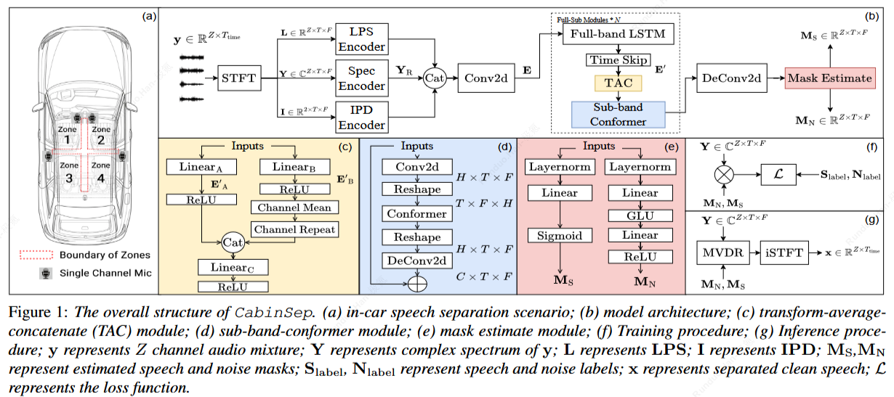

# CabinSep: IR-Augmented Mask-Based MVDR for Real-Time In-Car Speech Separation with Distributed Heterogeneous Arrays
Demo clips for "CabinSep: IR-Augmented Mask-Based MVDR for Real-Time In-Car Speech Separation with Distributed Heterogeneous Arrays"

Abstract: Separating overlapping speech from multiple speakers is crucial for effective human-vehicle interaction. This paper proposes CabinSep, a lightweight neural mask-based minimum variance distortionless response (MVDR) speech separation approach, to reduce speech recognition errors in back-end automatic speech recognition (ASR) models. Our contributions are threefold: First, we utilize channel information to extract spatial features, which improves the estimation of speech and noise masks. Second, we employ MVDR during inference, reducing speech distortion to make it more ASR-friendly. Third, we introduce a data augmentation method combining simulated and real-recorded impulse responses (IRs), improving speaker localization at zone boundaries and further reducing speech recognition errors. With a computational complexity of only 0.4 GMACs, CabinSep achieves a 17.5% relative reduction in speech recognition error rate in a real-recorded dataset compared to the state-of-the-art DualSep model.

Demos are available at: https://cabinsep.github.io/cabinsep/
